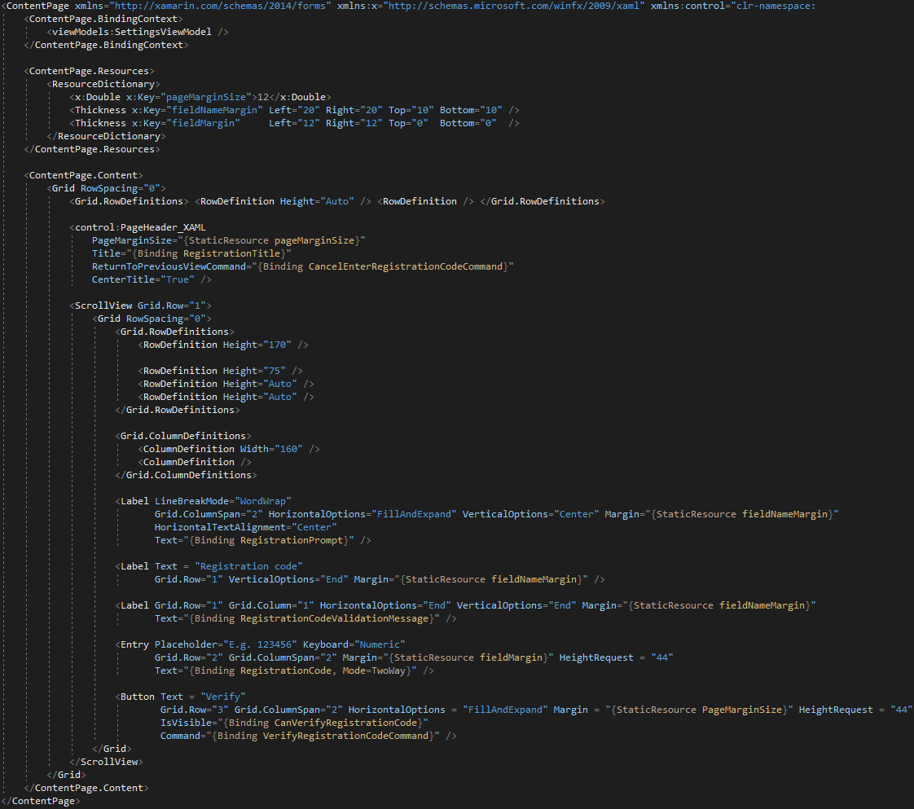
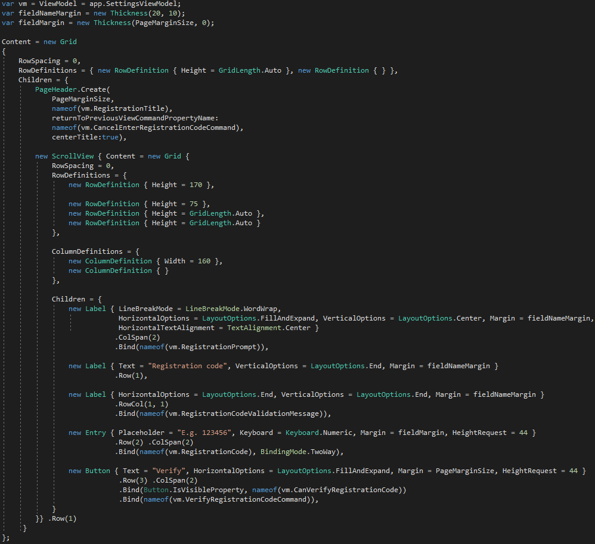
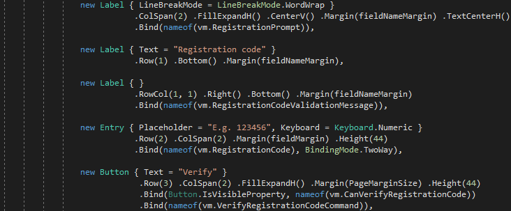

# CSharpForMarkup
Use declarative style C# instead of XAML for Xamarin Forms UI.

All you need are [these simple helpers](src/XamarinFormsMarkupExtensions.cs); include the single .cs file in your project and off you go.

The helpers offer a fluent API with **Bind**, **Invoke**, **Assign**, **Row**, **Col**, inline converters and more. Simple to change/extend.

## Why?
Because **declarative style** C# has a much better developer experience and reads virtually the same as XAML.

If you already know XAML, you can keep using your knowledge in declarative C#, and gain productivity (because of the better IDE support for C#).

The syntax is very close to XAML; you should be familiar within a couple of hours.

## Declarative C# versus XAML
Compare this Entry markup:

 XAML

 C#, close to XAML

 C#, shorter

Use **Invoke** to execute code inline in your declarative markup:
```CSharp
new ListView { }.Invoke(l => l.ItemTapped += MyListView_ItemTapped)
```
Use **Assign** if you need to access a control from outside the markup:
```CSharp
new ListView { }.Assign(out MyListView),
```

How about a real-world page? Here is a simple registration code page (taken from a production app):

XAML:



C#, close to XAML:



By using more helper methods, you can further improve C# readability (but it will be less simular to the XAML):



This markup follows some conventions. For each control:
- Bound properties are last, one per line
- The line before the bound properties is about layout, ordered inward: rows / cols, layout options, margin, size, padding, content alignment
- Before that are the other properties; any property that identifies the control's purpose comes first (e.g. Text or Placeholder)

### Reading Pro's:
C#
- Numbers and enums don't need quotes
- Constants don't need keyword or quotes (i.e. **name** vs **"\{StaticResource name\}"** )
- Can use calculated constants (i.e. **marginb = margina + 10**)
- Don't need parent class (i.e. **RowDefinitions** vs **Grid.RowDefinitions**)
- Designed for human readability

XAML
- Don't need enum name (i.e. **"End"** vs **LayoutOptions.End**)
- Don't need **new** keyword for each control
- Don't need **Children = \{** or **Content =** for child controls
- Designed for (visual designer) tools
  
### Editing Pro's:
C#
- No strings for properties: rename, code lens (where/not) used, compile time safety all just work
- Better IntelliSense (i.e. in XAML margins are strings)
- Simpler markup reuse (control builder method with parameters)
- Simple extensibility (i.e. don't need to write XAML extensions; customize your markup syntax with extension methods, creating your own DSL if you like)
- Better Diff & Merge
- Live view in Live Player (very limited - no renderers etc)
- Live view coming in [Live XAML](https://www.livexaml.com/) (few limitations) 

XAML
- Live view in Live Player; visual preview in IDE (very limited - no renderers etc)
- Live view in [Live XAML](https://www.livexaml.com/) (few limitations) 

## Summary
The question of C# versus XAML is not so much "Why use C# for markup?" as it is "**Why use XAML for markup?**"

- Why would you want to hand-code an object serialization format?
- Why would you choose a different language for markup if it reads the same but has inferior IDE support?

## Background
This repo resulted from this discussion on the Xamarin Forms forum:
[Using declarative style C# instead of XAML - should Xamarin redirect XAML efforts elsewhere?](https://forums.xamarin.com/discussion/123771/using-declarative-style-c-instead-of-xaml-should-xamarin-redirect-xaml-efforts-elsewhere?)

Imo XAML in Xamarin Forms exists for historical reasons, to convince developers that are familiar with other Microsoft XAML dialects to onboard. However, if used as above, developers can use their existing XAML knowledge in C#. It should not take more than a day to become accustomed to the small syntax changes, to gain productivity every day.

NJoy!